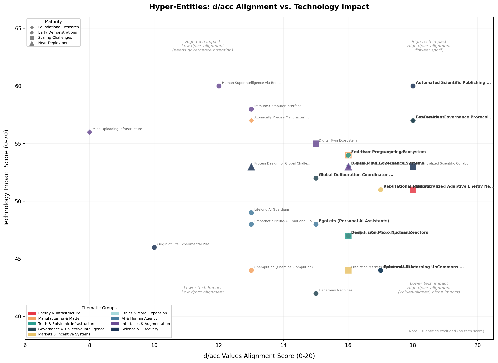

# Hyper-Entities: Consensus Highlights Report

Linda Petrini & Beatrice Erkers  
Foresight Institute  
February 2026

---

## Executive Summary

**What are hyper-entities?** A hyper-entity is a coherent future system that doesn't exist yet but is already reshaping the present. Think of [fusion energy](https://en.wikipedia.org/wiki/Fusion_power) in the 1970s, or the [Human Genome Project](https://www.genome.gov/human-genome-project) in 1990: ambitious systems that reorganized billions in investment and created new institutions years before producing results. They matter because they reveal where coordination is forming around shared technological futures, and because getting the *right* systems built could determine whether emerging technologies concentrate or distribute power. This report identifies 39 such entities, drawn from [Existential Hope](https://existentialhope.com), Foresight Institute's initiative mapping positive long-term futures, that deserve attention, investment, and governance focus today.

**How we found them.** We analyzed 108 documents from the [Existential Hope](https://existentialhope.com) community (podcast transcripts, world gallery scenarios, [AI pathways essays](https://ai-pathways.existentialhope.com/)). An AI pipeline extracted over 300 candidates, scored on hyper-entity qualification, technology impact, and [d/acc values alignment](https://vitalik.eth.limo/general/2023/11/27/dacc.html) (democratic, decentralized, defensive, differential acceleration). Two independent reviewers curated these to 39 consensus entities.

**What we found: overlooked infrastructure.** The scatter plot below positions entities by values alignment and technology impact. The upper-right "sweet spot" includes [Automated Scientific Publishing](https://www.lesswrong.com/posts/kAgJJa3HLSZxsuSrf/we-need-a-theory-of-anthropic-measure-binding) for machine consumers, [LexCommons](https://lexdao.org/) (open-source legal infrastructure built on [LexDAO](https://lexdao.org/)'s work), and Competitive Governance Protocol Stacks. The upper-left highlights powerful technologies needing urgent governance: [brain-computer interfaces](https://neuralink.com/), [mind uploading](https://en.wikipedia.org/wiki/Mind_uploading), and others with high potential but uncertain power dynamics.

**Patterns and a call to action.** The 39 entities cluster into 9 thematic groups, and the clustering reveals how the Foresight community is betting on *stacks*: interconnected systems that reinforce each other. Privacy infrastructure enables governance experimentation; scientific publishing for machines accelerates AI-assisted research. If you're allocating capital, regulatory attention, or research priority, ask: "what infrastructure prevents powerful technologies from becoming centralized bottlenecks?" These systems need decade-long funding timelines, patient capital, and regulatory frameworks designed for experimentation. They also need to be *named*, brought into policy conversations dominated by AGI timelines and semiconductor export controls. The future's infrastructure is being built now, often quietly. This report maps where.

---

## Introduction

### What Are Hyper-Entities?

A *hyper-entity* is a coherent, future-instantiated system that does not yet exist but is treated as if it will. Its realization would create a new stable action space for humanity, and it already reorganizes coordination, investment, and narrative around its anticipated existence. The term was coined by Michael Nielsen, whose broader definition informed this project's more operationally focused criteria.

Nielsen emphasized the design dimension: hyper-entities as orienting visions that carry new affordances, requiring imagination and depth of understanding to conceive. This project adds an operational criterion: the entity's anticipated existence is already causally active, reshaping coordination and investment before any prototype exists. (That causal dimension is closer to what Nick Land calls *hyperstition*, a self-fulfilling prophecy, though Nielsen himself draws a distinction between the two terms.)

Three characteristics define a hyper-entity:

1. **Not yet built.** Exists at most as an idea or early sketch, not a working system at scale.
2. **Transformative.** Would enable new human capabilities, not incremental improvements on existing ones.
3. **Already reshaping the present.** The mere *expectation* of its existence drives how people invest, coordinate, and talk about the future. A hyper-entity has causal force before it exists.

Historical examples: the Internet (pre-1990s) reorganized telecoms R&D, policy, and venture capital before widespread deployment. The Space Race (1950s-60s) organized national budgets and education systems before any launches. AGI today reshapes AI research priorities, corporate strategies, and policy discussions despite not yet existing.

### Project Overview

This project systematically identifies, scores, and curates hyper-entities emerging from the Foresight Institute's research discourse. The source material:

- **65 podcast transcripts** from the [Existential Hope podcast](https://existentialhope.com/podcast) by the Foresight Institute
- **40 world-gallery submissions** from [Existential Hope](https://existentialhope.com), the Foresight Institute's initiative mapping positive long-term futures
- **2 AI-pathways essays**, including Vitalik Buterin's [d/acc framework](https://vitalik.eth.limo/general/2023/11/27/techno_optimism.html) and its [2025 update](https://vitalik.eth.limo/general/2025/01/05/dacc2.html)
- **1 Existential Hope Hackathon report**

From this corpus, over 300 candidate hyper-entities were extracted, scored across three assessment stages, clustered thematically, and curated through independent review by two researchers (Linda Petrini and Beatrice Erkers). The final consensus list contains 39 highlighted entities.

### Why This Matters: The AGI Crowding-Out Problem

Technology discourse in 2025 might lead you to conclude that artificial general intelligence is the only future worth preparing for. In 2024, over $252 billion in corporate investment flowed into AI and AGI companies, [nearly 12 times China's AI investment](https://hai.stanford.edu/ai-index/2025-ai-index-report/economy). In 2025, AI startups alone raised [$211 billion in venture capital](https://dataconomy.com/2026/02/02/global-ai-funding-hits-211-billion-in-2025/), an 85% year-over-year increase, with [projections exceeding $500 billion for 2026](https://www.goldmansachs.com/insights/articles/why-ai-companies-may-invest-more-than-500-billion-in-2026). Major governments have appointed AI safety czars. CEOs discuss "the arrival of superintelligence" in quarterly earnings calls.

AGI could indeed be transformative. But this concentration creates what economists call a crowding-out effect: when one opportunity dominates attention and capital, other valuable investments get systematically underfunded.

This project asks a different question. Not "what hyper-entity is most likely to arrive?" but "which ones *should* we be naming, funding, and building toward, given the kind of future we actually want?"

Our research identifies 39 such entities, spanning planetary-scale energy systems, collective decision-making tools, programmable biology, and infrastructure for shared truth. Many score highly on metrics that should matter to rational funders: broad benefit distribution, downside protection, and resilience to political shifts.

Yet they receive fragmentary attention. Consider epistemic infrastructure: systems that help communities establish shared facts and navigate information disorders. By our analysis, projects in this space align strongly with human values and address urgent coordination failures. The biggest philanthropic initiative in the space, Google's [Global Fact Check Fund](https://www.poynter.org/ifcn/grants-ifcn/globalfactcheckfund/), totals $13.2M, what OpenAI spends in [under 24 hours](https://www.datacenterdynamics.com/en/news/openai-training-and-inference-costs-could-reach-7bn-for-2024-ai-startup-set-to-lose-5bn-report/). The pattern repeats across governance innovation, distributed energy systems, and open science infrastructure.

This imbalance carries real costs. Many of these overlooked systems are critical infrastructure for human flourishing regardless of AGI timelines. Whether artificial superintelligence arrives in 2030 or 2080, we will still need resilient energy systems, tools for democratic legitimacy, and ways to manage synthetic biology safely.

Several entities on our list would also help society navigate AGI's arrival more safely. Better epistemic infrastructure enables clearer public deliberation about AI governance. Advanced collective intelligence systems could help coordinate international AI safety regimes. We are underfunding the very tools we would need to handle the future we are investing so heavily in creating.

The argument isn't anti-AGI. It's closer to portfolio theory applied to civilizational bets: under genuine uncertainty, concentration in a single scenario carries real risk. Infrastructure that creates value across many possible futures is worth naming, even if the allocation decisions belong to others.

The d/acc framework (emphasizing technologies that distribute power, offer strong defense, and enable cooperation) provides one lens for spotting these overlooked opportunities. Our 39 hyper-entities are a starting point for a more balanced conversation about which futures deserve resources, coordination, and policy attention.
## Methodology

### Three-Stage Scoring Pipeline

Scoring was performed by Claude (Anthropic's AI assistant) via API, with human review and curation at each stage. The final entity selection was entirely human-driven through independent shortlisting by two researchers.

**Stage 1: Hyper-Entity Qualification (0-100).** Each candidate is scored on 9 axes (0-3 per axis): Non-existence, Plausibility, Design specificity, New action space, Roadmap clarity, Coordination gravity, Resource pull, Narrative centrality, and Pre-real effects. A candidate must score 67% or above to qualify.

**Stage 2: Technology Impact Assessment (0-100).** Qualified entities are scored on 14 dimensions (0-5 each) measuring the magnitude of potential effect, not desirability. Higher scores indicate greater transformative power *and* greater systemic risk.

**Stage 3: d/acc Values Alignment (0-100).** Based on Vitalik Buterin's d/acc framework, evaluating whether a technology aligns with values that promote human flourishing.

### The d/acc Framework

We adopt Vitalik Buterin's d/acc framework, originally proposed in the context of technology acceleration debates, as a values-alignment lens. The four dimensions (Democratic, Decentralized, Defensive, Differential) capture whether a technology distributes power broadly, protects more than it threatens, and creates positive-sum outcomes. This lens is applicable regardless of one's views on crypto or acceleration debates.

- **Democratic**: Does this technology enable collective decision-making, or does it concentrate decisions in elites?
- **Decentralized**: Does it distribute power broadly, or create single points of control?
- **Defensive**: Does it favor protection over harm? Is it defense-favoring?
- **Differential**: Does it create positive asymmetries, improving defense and freedom more than enabling attack and control?

We score each entity 0-5 on each dimension (0-100% normalized). A high d/acc score signals that a technology, if realized, would likely expand human agency and resilience rather than concentrate power or create new vulnerabilities.

### How to Read the Scores

This report evaluates hyper-entities using two independent scoring systems that measure different things.

### d/acc Values Alignment (0-100%): The "How" Score

Based on Vitalik Buterin's ["My techno-optimism"](https://vitalik.eth.limo/general/2023/11/27/techno_optimism.html) framework, this measures alignment with principles of human flourishing. Each entity receives 0-5 points across four dimensions:

- **Democratic**: Does it distribute benefits broadly or concentrate power?
- **Decentralized**: Does it enable resilience through distributed control?
- **Defensive**: Does it protect against catastrophic risks or create new vulnerabilities?
- **Differential**: Does it accelerate beneficial technologies faster than dangerous ones?

Higher scores indicate better alignment with d/acc values. A score of 75%+ suggests strong alignment; below 50% raises governance concerns. This is explicitly a normative framework—it evaluates whether we *should* want something to exist.

### Technology Impact (0-100%): The "How Much" Score

This measures the *magnitude* of potential transformation across 14 dimensions including infrastructure disruption, economic scale, geopolitical implications, and workforce effects. **This is not a desirability score.** A nuclear weapon and a universal vaccine might both score high: the metric captures transformative power, not whether that power serves human interests.

High impact means high stakes: greater potential for both benefit and harm, larger systemic dependencies, more urgent need for robust governance. Low scores don't mean "bad"; they may indicate specialized tools serving specific communities well.

### Reading the Scatter Plot

The positioning reveals strategic priorities:

**Upper-right quadrant** (high impact, high d/acc): Technologies that could transform society *and* align with human flourishing values. These deserve the most attention, funding, and development support.

**Upper-left** (high impact, low d/acc): Powerful technologies with concerning governance trajectories. These require careful oversight, regulatory frameworks, and explicit efforts to improve their d/acc alignment before widespread deployment.

**Lower-right** (low impact, high d/acc): Values-aligned but niche. Important for specific use cases, less urgent for broad policy attention.

**Lower-left**: Lower priority within this analytical framework.

Ten entities received d/acc scores but no technology impact assessment (marked N/A). These were too abstract or conceptual for meaningful technology evaluation, though their governance implications remain important to track.

**Estimated timelines** are provided where meaningful, though hyper-entities by definition resist precise forecasting. Ranges should be interpreted as order-of-magnitude guidance rather than predictions.

### Curation Process

After automated extraction and scoring, entities were curated through independent review:

1. **Independent shortlisting**: Linda and Beatrice each independently reviewed the full set and starred those they considered most significant. Linda selected 88; Beatrice selected 67.
2. **Overlap identification**: 26 entities were starred by *both* reviewers (20.2% overlap rate), forming the core consensus set.
3. **Cross-review voting**: Each reviewer then reviewed the other's unique picks, voting Yes on entities they also found compelling.
4. **Final list**: The resulting 39 entities (26 shared + 8 + 5 cross-reviewed) constitute the consensus highlights.

Beyond mapping what hyper-entities exist, this project is intentional about which ones *deserve* more attention, investment, and coordination. The 39 entities highlighted here were chosen not just because they scored highly, but because we believe they represent under-resourced futures worth building toward.

Entity analyses were produced by Claude (Anthropic's AI) from the source material and reviewed by the research team. Open Questions sections reflect real uncertainties in the field, not editorial positions.
## Key Findings

### The Landscape: d/acc Alignment vs. Technology Impact

*29 of 39 entities plotted; 10 entities excluded due to missing technology impact scores.*

### Most Undervalued Shortlist

The following entities score well on our framework but receive disproportionately little attention and funding:

- **Chemputing (Chemical Computing)**, d/acc: 65%, Tech: 63%

- **Epistemic Stack**, d/acc: 85%, Tech: 63%

- **LexCommons**, d/acc: 90%, Tech: 81%

- **Conflict De-escalation Protocol**, d/acc: 80%, Tech: N/A

- **Gevulot (Privacy Infrastructure)**, d/acc: 90%, Tech: N/A

- **Automated Scientific Publishing Ecosystem for Machine Consumers**, d/acc: 90%, Tech: 86%

- **Universal AI Learning UnCommons (UALU)**, d/acc: 85%, Tech: 63%

### Maturity Distribution

| Maturity Level | Count |
|---|---|

| Foundational Research | 11 |

| Early Demonstrations | 20 |

| Scaling Challenges | 6 |

| Near Deployment | 2 |

## Consensus Entities

The 39 consensus entities fall into nine thematic groups. One pair of entries (Reputational Markets and Prediction Markets as Decision Support Systems) is presented as a single merged entity, Prediction & Reputation Markets. 15 entities receive full write-ups; 24 appear in summary format.

### AI & Human Agency

The premise linking these entities is provocative: beneficial AI might emerge through deeply personalized systems operating at the scale of individual lives, not populations. Unlike chatbots serving millions identically, these proposals envision AI with long-term commitments to specific people, filtering information on your behalf, coaching you through emotional challenges, or holding legal obligations to act in your interest alone. The pattern reveals a bet that agency and alignment problems are easier to solve when AI systems have clear principals and sustained relationships rather than trying to optimize for humanity in aggregate.

### Fiduciary AI Assistance
`Foundational Research`

**Why it matters.** Every AI assistant you use today (ChatGPT, Claude, Gemini) is optimized for its platform's goals, not yours. They're designed to keep you engaged, extract your data, and serve corporate objectives. Fiduciary AI flips this: imagine a digital agent legally and technically bound to your welfare alone, helping you navigate career decisions, health choices, and financial planning with guaranteed loyalty. As AI grows more capable, "whose interests does it serve?" becomes an existential question. A world where individuals have aligned AI advocates could democratize access to expert judgment and rebalance power away from platforms that profit from manipulating attention.

*d/acc: 80% | Tech: N/A*

**Where things stand.** The concept has gained intellectual traction: [Metaculus](https://metaculus.com) founder Anthony Aguirre has championed "loyal AI assistance" as a north star. But current implementations are primitive. Today's closest approximations are robo-advisors like [Betterment](https://www.betterment.com) and [Wealthfront](https://www.wealthfront.com), which operate under financial fiduciary standards but handle only narrow investment tasks. Consumer AI assistants like [Inflection AI](https://inflection.ai)'s Pi attempted user-first design through subscription models, but Inflection was effectively acquired by Microsoft in 2024 before proving viability. On the technical side, [Hugging Face](https://huggingface.co) supports on-device AI deployment for privacy, and Constitutional AI research explores encoding user values, but no system today mathematically guarantees individual welfare as its optimization target. The legal infrastructure is nonexistent: no jurisdiction has defined what fiduciary duty means for software.

**Who's pushing it forward.** [Inflection AI](https://inflection.ai) made the most serious commercial attempt before pivoting. AI safety researchers at [Center for AI Safety](https://www.safe.ai) and [Open Philanthropy](https://www.openphilanthropy.org) have explored related alignment questions under "tool AI" frameworks. The EU AI Act (2024) introduces user-protection requirements, though nothing approaching fiduciary duty. Startups like [Character.AI](https://character.ai) and [Replika](https://replika.com) build persistent personal AI relationships but without loyalty guarantees.

**Open questions & key uncertainties.** The business model problem is unsolved: fiduciary AI can't manipulate users for engagement or harvest data for advertisers, but subscription revenue hasn't proven sufficient at scale. Technically, we lack methods to encode "long-term user welfare" when users themselves are inconsistent. Should your AI let you eat the cookie or enforce your diet? This paternalism dilemma has no current solution. On the legal side, what does it mean for software to breach fiduciary duty, and who enforces it? Until someone demonstrates a profitable path to individual-first AI, platforms have every incentive to maintain the status quo.

### EgoLets (Personal AI Assistants)
`Early Demonstrations`

**Why it matters.** Today's AI assistants provide the same generic advice to everyone. EgoLets promise something different: personalized AI systems that learn how *you* specifically think, decide, and weigh tradeoffs, creating what author Ken Liu calls "little versions of your ego" trained intensely on your personal data. Instead of outsourcing decisions to generic algorithms, individuals would gain cognitive partners that mirror their reasoning across professional strategy, creative projects, and financial planning. This shifts AI from automation tool to personalized augmentation, potentially democratizing the kind of bespoke decision support currently available only through expensive human advisors.

*d/acc: 75% | Tech: 69%*

**Where things stand.** Current personal AI assistants like [OpenAI](https://openai.com)'s ChatGPT (with memory features launched 2024), [Anthropic](https://anthropic.com)'s Claude, and Google's Gemini learn user preferences through conversation history. Startups like [Inflection AI](https://inflection.ai), [Replika](https://replika.com), and [Character.AI](https://character.ai) explore personality modeling and emotional rapport. Apple Intelligence (2024) integrates on-device personal context. But none construct cognitive portraits that mirror individual reasoning architectures; they personalize outputs, not decision-making frameworks. The gap between "remembers what you said" and "thinks like you think" remains vast. We can save conversation context. We cannot yet capture the subtle heuristics, contradictions, and domain-specific expertise that define how a person actually makes choices.

**Who's pushing it forward.** The technical building blocks are advancing separately: [OpenMined](https://openmined.org) develops privacy-preserving machine learning for training on personal data without centralized exposure. [Hugging Face](https://huggingface.co) enables distributed model deployment. Microsoft's Copilot and [GitHub Copilot](https://github.com/features/copilot) demonstrate domain-specific assistance that learns individual coding or writing patterns. Research from the [Allen Institute for AI](https://allenai.org) explores knowledge graph construction. But no major organization is explicitly building toward EgoLets as Liu envisioned them: systems that create faithful cognitive proxies across life domains. The concept exists more as design challenge than funded roadmap.

**Open questions & key uncertainties.** Three core barriers block true EgoLets. First, we lack methods to evaluate "cognitive fidelity," meaning how we measure whether an AI's decisions match what you would actually choose. Second, human reasoning is contextual, contradictory, and evolving; any static portrait becomes stale or reductively simplifies messy humanity. Third, unresolved questions surround identity and liability when an AI acts as your cognitive proxy: Who's responsible for its recommendations? What happens when your EgoLet disagrees with your current self? Can you consent to an AI that knows you better than you know yourself? Pragmatically, data portability standards don't exist to aggregate your decision history across platforms. The raw material EgoLets would need remains siloed across incompatible services.

#### Additional Entities

| Entity | Maturity | d/acc | Tech | Summary |

|--------|----------|-------|------|---------|

| Empathetic Neuro-AI Emotional Coaching System | Early Demonstrations | 65% | 69% | An AI system providing continuous, personalized emotional support by analyzing neural signals and behavioral patterns to detect and intervene before mental health crises occur. It addresses the mismatch between constant human psychological needs and limited therapist availability, potentially offering 24/7 mental health support at scale. Mental health care demand vastly outstrips supply (average therapy wait times stretch weeks to months) while emotional crises don't follow business hours. |

| Lifelong AI Guardians | Early Demonstrations | 65% | 70% | Lifelong AI Guardians would create continuous, privacy-preserving monitoring systems that track children's development across fragmented settings (schools, homes, healthcare visits) detecting early warning signs that currently fall through institutional cracks. These systems aim to shift child welfare from reactive crisis response to proactive support by building longitudinal profiles that spot subtle developmental deviations before they become serious problems. Developmental challenges caught early are far more treatable, yet our current siloed institutions routinely miss critical signals until intervention becomes costly and less effective. |

### Energy & Infrastructure

These three entities share a diagnosis: existing energy and governance systems move too slowly for the pace of climate change and technological opportunity. Each bypasses centralized infrastructure rather than waiting for it to improve, whether through mesh energy networks that route around utilities, small modular reactors that skip traditional nuclear timelines, or jurisdictions that compete for climate adaptation investment. The underlying bet is that coordination problems in energy and climate will be solved by creating alternatives that make old systems obsolete.

### Decentralized Adaptive Energy Network
`Scaling Challenges`

**Why it matters.** Centralized power grids waste enormous amounts of energy: up to 60% of generated electricity can be lost in transmission and distribution. They also struggle with intermittent renewables like solar and wind, forcing curtailment of clean energy during peak production. A decentralized adaptive network would invert this model. AI coordinates millions of distributed energy sources (rooftop solar, home batteries, EVs) to trade power peer-to-peer, routing electricity based on real-time local supply and demand. The payoff: renewable energy's full potential unlocked, a more resilient grid, and households with actual control over their energy.

*d/acc: 90% | Tech: 73%*

**Where things stand.** The building blocks exist separately but haven't converged into a fully integrated system. Virtual power plants (VPPs, networks of distributed energy resources coordinated to behave like a single large generator) aggregate distributed resources. Tesla's South Australian program connects thousands of home Powerwalls to act as grid-scale storage, while [Power Ledger](https://www.powerledger.io) enables peer-to-peer energy trading among solar households. AI-driven optimization is real: [AutoGrid](https://www.auto-grid.com) uses machine learning for demand forecasting and load balancing. The [Energy Web Foundation](https://www.energyweb.org) has built blockchain infrastructure for energy sector decentralization. But these remain isolated pilots, not the seamless, self-organizing network envisioned. Current systems are centralized control with distributed elements, not decentralized coordination.

**Who's pushing it forward.** Several pathways are emerging. Tesla's Autobidder platform (operational since 2020) manages grid-scale battery trading. Germany's Sonnen Community and Australia's Reposit Power offer early peer-to-peer trading models. Smart inverter manufacturers are building vehicle-to-grid (V2G) capabilities as EVs become mobile grid assets. The primary actors are energy startups, forward-thinking utilities in Germany and Australia, and blockchain infrastructure providers. The most significant barrier, though, is regulatory. Electricity markets globally were designed for one-way power flow from centralized plants, and incumbent utilities have revenue models that actively resist democratized energy control.

**Open questions & key uncertainties.** Can millions of distributed devices coordinate in real-time without centralized dispatch? The cybersecurity challenge is serious: a distributed network offers a massive attack surface. Grid stability requires split-second frequency and voltage regulation, and whether decentralized algorithms can match centralized control remains unproven at scale. Interoperability standards are fragmented (IEEE 2030.5, OpenADR, competing protocols), making seamless device communication difficult. Most critically, will regulators and utilities embrace business model disruption, or will institutional resistance delay deployment by decades? The likely path is gradual evolution over 10-20 years, more creeping decentralization than clean break.

### Deep Fision Micro Nuclear Reactors
`Early Demonstrations`

**Why it matters.** Modern power grids are brittle by design. A single storm or attack can darken entire regions for days. [Deep Fission](https://deepfission.com) is developing car-sized nuclear reactors that fit through a manhole, designed to be buried a mile underground and operate autonomously for 30-50 years without human intervention. The goal is mass-manufacturing nuclear power like automobiles, then deploying reactors where they're needed: remote communities, military bases, data centers, critical infrastructure. If it works, energy becomes distributed and resilient to catastrophic grid failures, localized enough that communities gain real energy independence.

*d/acc: 80% | Tech: 67%*

**Where things stand.** No borehole reactor has been built or tested at prototype scale yet. Deep Fission, emerging from Pablos Holman's Intellectual Ventures ecosystem, is competing in a crowded field of over 100 small modular reactor (SMR) ventures. The broader SMR movement has made recent progress: [NuScale Power](https://www.nuscalepower.com) received the first-ever NRC design certification for an SMR in 2023 (though its flagship Idaho project was cancelled due to cost overruns), while [TerraPower](https://www.terrapower.com) broke ground on its Natrium reactor in Wyoming in 2024, and [Kairos Power](https://kairospower.com) secured a construction permit for its test reactor in 2023. Deep Fission's underground, thorium-based design is a more radical departure from conventional nuclear architecture: sealed cores that can't melt down, fuel that can't be weaponized, and zero above-ground footprint.

**Who's pushing it forward.** Deep Fission is leading the borehole concept, backed by the Intellectual Ventures spinout network. The US Nuclear Regulatory Commission has reformed its licensing process to accelerate advanced reactor reviews, creating regulatory pathways that didn't exist a decade ago. International momentum is building: Sweden's parliament voted in 2024 to expand nuclear capacity, signaling a European policy shift. The challenge is that Deep Fission's competitors (NuScale, TerraPower, Kairos) already have physical test facilities and are years ahead in the regulatory queue.

**Open questions & key uncertainties.** The regulatory framework for autonomous underground nuclear generation doesn't exist; no one has written the rules for this deployment mode. Can Deep Fission convince regulators to certify a reactor design that operates untouched for decades in an inaccessible location? The economics are unproven: factory manufacturing at automotive scale requires gigafactory-level capital investment before a single unit generates revenue. Will communities accept distributed underground nuclear installations, even with inherent safety advantages? Public acceptance remains completely untested. It's also unclear whether thorium fuel cycles can be manufactured and deployed at the claimed cost and timeline, since the supply chain doesn't exist yet.

#### Additional Entities

| Entity | Maturity | d/acc | Tech | Summary |

|--------|----------|-------|------|---------|

| Climate Adaptation Jurisdictional Arbitrage | Early Demonstrations | 80% | N/A | Climate Adaptation Jurisdictional Arbitrage proposes building new cities and special economic zones designed to absorb climate migrants before displacement crises occur, turning forced migration into an opportunity for economic development. Rather than waiting for millions to flee uninhabitable regions and overwhelm unprepared cities (as we're already seeing with heat waves in South Asia and sea-level rise in Pacific islands), this approach would create legal and economic frameworks for people to relocate to purpose-built communities with jobs, infrastructure, and integration pathways. The concept matters because current climate migration projections suggest 200 million to 1 billion people could be displaced by 2050, and reactive humanitarian responses have consistently failed to provide dignified, economically productive outcomes for displaced populations. |

### Ethics & Moral Expansion

The hyper-entities in this cluster explore technologies and institutional frameworks designed to expand humanity's capacity for moral consideration beyond current tribes, species, and timeframes. They share a premise: our moral intuitions evolved for small-scale societies and may be inadequate for planetary-scale impacts and potentially transformative AI. Together, they suggest that moral progress could be deliberately engineered through new tools for perspective-taking, value alignment, and inter-group negotiation, rather than left to cultural evolution alone.

### Expanded Moral Circle Technologies
`Foundational Research`

**Why it matters.** We're approaching a world with multiple forms of intelligence—biological, artificial, and potentially others—yet we lack the tools to understand each other's experiences. Current communication technologies translate words but fail to convey the texture of consciousness itself: what it feels like to be an octopus, how an AI model "experiences" a prompt, whether a whale's song carries something we'd recognize as meaning. This gap creates ethical blindspots, making it impossible to recognize suffering or sentience in very different minds. Technologies that could bridge these experiential divides might enable the most significant expansion of moral consideration since the abolition movements.

*d/acc: 80% | Tech: N/A*

**Where things stand.** We're in the proof-of-concept phase for individual pieces, not the integrated vision. The [Earth Species Project](https://www.earthspecies.org) uses machine learning to decode animal vocalizations, while [Project CETI](https://www.projectceti.org) published 2024 results showing contextual structure in sperm whale communication. Psychedelic research at institutions like Johns Hopkins has demonstrated that substances like psilocybin measurably increase nature-connectedness and emotional empathy. Neurotechnology companies like [Neuralink](https://neuralink.com) and [Synchron](https://synchron.com) are developing brain-computer interfaces, though these focus on motor control and medical applications rather than experiential translation. The philosophical groundwork is advancing: the 2024 New York Declaration on Animal Consciousness argued for taking seriously the possibility of consciousness in invertebrates, while researchers like Eric Schwitzgebel have proposed frameworks for assessing AI moral status. But we can decode signals without understanding their phenomenology, what philosopher Thomas Nagel called the "what is it like" problem.

**Who's pushing it forward.** The convergence is happening across separated fields. [Project CETI](https://www.projectceti.org), funded by the Audacious Project since 2020, is the flagship cross-species communication effort. Consciousness research centers at Johns Hopkins (opened 2020) and Imperial College London are mapping how altered states affect empathy and perspective-taking. The [Collective Intelligence Project](https://cip.org) explores governance structures that could incorporate diverse intelligence types. Legal innovation is proceeding separately: New Zealand granted the Whanganui River legal personhood in 2017, creating precedent for non-human moral status.

**Open questions & key uncertainties.** The core challenge is whether subjective experience can be translated at all across very different cognitive architectures. Even if we decode an animal's neural patterns, do we have the conceptual apparatus to represent their phenomenology? We lack a science of consciousness robust enough to determine who merits moral status; the "hard problem" remains unsolved. Practically, the technology requires breakthroughs in neural mapping granularity that may not be feasible with current physics. The coordination problem is equally severe: expanding moral circles requires simultaneous advances in consciousness science, communication technology, and legal frameworks that currently operate in separate institutional silos. Most likely, progress happens through concrete demonstrations (using decoded whale communication to build legal personhood campaigns, for instance) rather than comprehensive empathy translation systems.

#### Additional Entities

| Entity | Maturity | d/acc | Tech | Summary |

|--------|----------|-------|------|---------|

| Moral Trade Civilization | Foundational Research | 80% | N/A | Moral Trade Civilization envisions a future where people and groups can systematically exchange ethical commitments—"I'll defer to you on animal welfare if you defer to me on cultural preservation"—turning moral conflicts from zero-sum fights into negotiable trades that leave everyone better off. This matters because today's biggest societal deadlocks, from climate policy to bioethics, fail not for lack of technical solutions but because we have no mechanism to honor legitimate moral diversity across populations, forcing crude majoritarian compromises that satisfy no one. If feasible, moral trade could unlock cooperative solutions to currently intractable conflicts by treating ethical preferences with the same sophistication that markets bring to economic preferences. |

### Governance & Collective Intelligence

What if governance worked more like software: testable, forkable, improvable? These systems bet that democracy's biggest threat isn't bad actors but bad interfaces, with decision-making too slow, opaque, or coercive for 21st-century complexity. They share an attempt to make collective intelligence tangible and measurable, pushing past "what should we do?" toward "how should we decide what to decide, and can we prove it worked?"

### Competitive Governance Protocol Stack
`Early Demonstrations`

**Why it matters.** Today's governance is a geographic lottery: you're born into a jurisdiction and stuck with its rules unless you can afford the enormous cost of emigrating. This protocol stack would create a governance marketplace where citizens carry portable digital identities, participate in multiple overlapping jurisdictions, and switch between them based on performance. Instead of one-size-fits-all nation-states, imagine selecting governance services (legal frameworks, public benefits, dispute resolution) the way you choose a mobile carrier, with jurisdictions competing on quality. The result: real accountability in public institutions and meaningful exit rights for individuals.

*d/acc: 90% | Tech: 81%*

**Where things stand.** The building blocks exist in isolation but aren't yet connected. [Estonia's e-Residency](https://www.e-resident.gov.ee) has issued digital identities to over 100,000 people worldwide since 2014, allowing them to access Estonian services and register companies remotely. The [Charter Cities Institute](https://chartercitiesinstitute.org) supports experiments in new jurisdictional models, while [Prospera](https://prospera.hn) in Honduras operated under special economic zone rules from 2020 until facing legal challenges in 2022. On the technical side, W3C finalized Decentralized Identifier and Verifiable Credential standards in 2022, providing the protocol layer for portable digital credentials. Tools like [Gitcoin Passport](https://passport.gitcoin.co) and [Snapshot](https://snapshot.org) enable thousands of on-chain governance experiments, though these remain limited to managing DAOs rather than providing comprehensive public services. The missing piece is the interoperability layer connecting these components into a coherent stack.

**Who's pushing it forward.** The intellectual foundation comes from Balaji Srinivasan's [The Network State](https://thenetworkstate.com) (2022), which articulates the vision of cloud-based jurisdictions competing for citizens. [Aragon](https://aragon.org) provides tools for creating and managing decentralized organizations with governance protocols. Special economic zone experiments continue despite setbacks: Honduras repealed its ZEDE legislation in 2022 under political pressure, a reminder of resistance from existing power structures. Estonia continues expanding its e-Residency program as a proof-of-concept for governance services detached from physical presence. The most promising near-term path involves connecting existing charter city projects through shared identity standards rather than building from scratch.

**Open questions & key uncertainties.** The core barrier is sovereignty: nation-states have a monopoly on legitimate force and zero incentive to enable frictionless citizen exit. Can a governance protocol achieve meaningful scale without buy-in from existing states? The technical challenges are significant but likely solvable: zero-knowledge proofs for privacy-preserving credential portability, sybil-resistant identity without centralized control, governance performance metrics resistant to gaming. The deeper problem is bootstrapping. The protocol only becomes valuable when multiple jurisdictions adopt it, creating a chicken-and-egg coordination problem that established geopolitical structures actively resist. Even if technical and legal barriers fall, it's unclear whether citizens actually want governance choice or prefer the simplicity of monolithic systems.

### LexCommons
`Foundational Research`

**Why it matters.** Getting justice is expensive and slow for most of humanity. Resolving a contract dispute can cost tens of thousands of dollars and take years, placing legal protection out of reach for billions. LexCommons envisions a global legal infrastructure where smart contracts, AI agents, and decentralized governance create an open-source alternative to traditional courts, handling everything from small claims to international disputes at a fraction of the cost. If realized, it would democratize access to legal protection and transform law from a closed institutional practice into a participatory global commons.

*d/acc: 90% | Tech: 81%*

**Where things stand.** Early building blocks exist, but no integrated system. [LexDAO](https://lexdao.org/) is the closest existing incarnation: a decentralized legal engineering guild on Ethereum, active since 2018, that develops smart contract tools and legal wrappers for DAOs. It operates as a small professional community rather than a full alternative legal infrastructure. [Kleros](https://kleros.io) has been running decentralized arbitration on Ethereum since 2018, processing thousands of disputes using crowdsourced jurors incentivized by tokens, proving blockchain-based dispute resolution works at small scale. AI legal tools like [Harvey AI](https://www.harvey.ai) (founded 2022, backed by Sequoia and OpenAI) now handle contract analysis and legal research using large language models. [Creative Commons](https://creativecommons.org) has shown open-source licensing can work at global scale. But these remain separate pieces. No system combines AI legal interpretation, blockchain enforcement, and participatory governance into a unified alternative to state-backed courts. Current smart contracts handle simple "if-then" logic well but struggle with ambiguous or context-dependent situations, the bread and butter of real legal disputes.

**Who's pushing it forward.** Decentralized governance platforms like [Aragon](https://aragon.org) and [Snapshot](https://snapshot.org) provide coordination infrastructure. AI companies are rapidly improving natural language understanding needed for legal interpretation. Legal tech startups are digitizing contracts and dispute resolution, though operating within traditional frameworks rather than replacing them. No major coordinated effort is building LexCommons as a coherent system; most work remains fragmented across separate domains.

**Open questions & key uncertainties.** The central challenge is legitimacy: legal systems derive authority from state recognition and enforcement power, which no decentralized alternative can replicate without government cooperation. Can code meaningfully replace human judgment for complex disputes? The 2016 DAO hack showed how code-as-law breaks down when outcomes diverge from intent. Cross-jurisdictional harmonization is extraordinarily difficult: the EU spent decades harmonizing commercial law among member states with shared political will. Bar associations actively regulate who can provide legal services, creating regulatory barriers to automated alternatives. Would states ever recognize or enforce LexCommons judgments? Without that, it's a parallel system with limited real-world teeth. The path forward likely involves gradual integration of modular components rather than wholesale replacement, but the timeline and feasibility remain uncertain.

While smart contract platforms like Ethereum exist, LexCommons represents the not-yet-built layer of AI-native legal agents and cross-jurisdictional open-source governance that no current system provides.

### Conflict De-escalation Protocol
`Foundational Research`

**Why it matters.** Most conflict resolution systems are adversarial by design: they produce winners and losers, not restored relationships. Courts, arbitration panels, and even human mediators often escalate tensions because they lack tools to dynamically read emotional states, power imbalances, and cultural context in real-time. An AI-powered mediation platform that progressively attempts win-win negotiation, then restorative justice, then proportional consequences could reshape how disputes are resolved, from workplace conflicts to international disagreements. Such a system would democratize access to sophisticated conflict resolution strategies currently available only through expensive human experts.

*d/acc: 80% | Tech: N/A*

**Where things stand.** The building blocks exist but not the integration. Online dispute resolution platforms like Modria (acquired by Tyler Technologies in 2017) and eBay's system handle over 60 million automated commercial disputes annually, proving algorithmic mediation works for structured conflicts. [Hume AI](https://www.hume.ai) can analyze vocal tone and facial expressions to assess emotional states in real-time. Mental health chatbots like [Woebot](https://woebothealth.com) use cognitive behavioral therapy dialogue strategies similar to de-escalation techniques. The [Consensus Building Institute](https://www.cbi.org) and Harvard's Program on Negotiation have developed systematic frameworks that could inform AI design. But no system combines emotional intelligence, game-theoretic strategy, and progressive escalation protocols into unified mediation software. Current NLP still struggles with the contextual subtlety required; misreading power dynamics or cultural norms in a tense conversation risks making things worse.

**Who's pushing it forward.** No dedicated organization is building this specific vision yet. The concept lives primarily in academic discussions about AI-assisted dispute resolution and in the design space of platforms like [Kleros](https://kleros.io), which uses decentralized arbitration for blockchain disputes but lacks a sophisticated emotional intelligence layer. [Character.AI](https://character.ai) and [Replika](https://replika.com) demonstrate conversational AI capable of extended dialogue, while [Polis](https://pol.is) shows how technology can surface common ground in group conflicts. These remain separate capabilities, not integrated into a mediation tool with progressive intervention strategies.

**Open questions & key uncertainties.** Can AI reliably make normative judgments about fairness and proportionality across different cultural contexts? The progressive framework requires the system to decide when negotiation has failed and restoration should begin, which is inherently contested territory. Who would trust an AI mediator in high-stakes conflict without demonstrated reliability and institutional backing? Liability remains unclear if the system's recommendations escalate rather than resolve disputes. The most pragmatic path likely starts with low-stakes, structured conflicts (landlord-tenant, workplace disagreements) where training data can be collected and outcomes measured. Whether parties in real conflict would accept algorithmic mediation over human judgment remains an open empirical question.

### Global Deliberation Coordinator (GDaaS)
`Early Demonstrations`

**Why it matters.** Global crises like climate change and pandemics require coordinated action, but today's international institutions move slowly and reflect power politics more than collective wisdom. The Global Deliberation Coordinator proposes a different approach: AI-mediated platforms that enable statistically representative samples of humanity to deliberate on existential challenges, producing policy recommendations with quantified confidence intervals. Done well, this could transform global governance from diplomatic horse-trading into democratic problem-solving at planetary scale, producing decisions faster and with broader input than the UN Security Council or COP negotiations.

*d/acc: 75% | Tech: 74%*

**Where things stand.** The concept remains largely hypothetical, though building blocks exist. Taiwan's vTaiwan process has used [Polis](https://pol.is) for AI-augmented deliberation on issues like Uber regulation, while [Collective Intelligence Project](https://cip.org) has run "Alignment Assemblies" to gather public input on AI governance. The OECD has documented over 600 citizens' assemblies across 30+ countries by 2024, and organizations like [newDemocracy](https://www.newdemocracy.com.au) and [Sortition Foundation](https://www.sortitionfoundation.org) run these processes regularly at national scale. Real-time multilingual translation has advanced significantly with tools like [DeepL](https://www.deepl.com) and Meta's [NLLB](https://ai.meta.com/research/no-language-left-behind/). But no system currently combines expert validation, representative sampling, cultural sensitivity, and binding authority at global scale.

**Who's pushing it forward.** The GDC concept was prototyped at [Foresight Institute](https://foresight.org)'s Existential Hope TAI Institution Design Hackathon in February 2024, winning shared second place. The team included Aviv Ovadya from [newDemocracy](https://www.newdemocracy.com.au), Joshua Tan from MetaGov, Evan Miyazono from Atlas Computing, and Bear Haon from Schmidt Futures. They're now pursuing "Advanced Market Commitments" from potential users and planning pilot deliberations. Meanwhile, Stanford's Deliberative Democracy Lab researches best practices, and the UN has experimented with AI-assisted multilingual dialogue tools.

**Open questions & key uncertainties.** Three core challenges remain unsolved. First, representative sampling: there's no credible mechanism to draw statistically representative panels from 8 billion people, since existing citizens' assemblies rely on national registries that don't exist globally. Second, legitimacy: even well-run deliberations are merely advisory unless governments commit to implementing outcomes, and major powers show little interest in ceding authority to transnational processes. Third, AI mediation risk: subtle framing effects in how AI systems translate, summarize, or map arguments could systematically bias deliberative outcomes in ways participants never notice. We also don't know if meaningful consensus is possible across deep cultural divides, or whether the "service" model (deliberation on demand) would attract genuine engagement or become performative theater.

#### Additional Entities

| Entity | Maturity | d/acc | Tech | Summary |

|--------|----------|-------|------|---------|

| Gevulot (Privacy Infrastructure) | Early Demonstrations | 90% | N/A | Gevulot would let you control exactly what information about yourself can be captured and who can access it, moment by moment, like adjusting volume controls instead of hitting mute. Today's privacy tools force an all-or-nothing choice: surrender your data completely or block access entirely, creating friction that prevents beneficial uses like medical research while failing to stop actual privacy violations. By making privacy granular and dynamic, Gevulot aims to rebuild trust in data sharing while preserving individual autonomy in an increasingly surveilled world. Gevulot is an early-stage project, not yet a deployed system — what's described here is the full vision, most of which remains to be built. |

| Habermas Machines | Early Demonstrations | 75% | 60% | Habermas Machines are AI systems designed to help diverse groups find common ground by processing everyone's input into clearer collective statements, cutting through the communication breakdowns and power dynamics that usually derail group decisions. Named after philosopher Jürgen Habermas, they promise to salvage democratic deliberation at a moment when polarization, information overload, and bad-faith debate have made consensus feel impossible. If they work, they could transform everything from corporate board meetings to citizen assemblies, though they raise hard questions about whether algorithms should mediate human understanding at all. |

### Mind, Brain & Human Augmentation

The shared premise here is that the boundary between human cognition and external systems can become permeable, bidirectional, and may eventually dissolve. Unlike tools we use or services we access, these technologies propose to extend, translate, replicate, or merge with human minds, making it increasingly hard to answer where the person ends and the system begins. The maturity spectrum is vast: translation models already reshape how billions communicate, while whole brain emulation remains speculative. The common thread is a future where human intelligence becomes a substrate that can be copied, enhanced, governed, or integrated with machines.

### Digital Mind Governance Systems
`Foundational Research`

**Why it matters.** As AI systems grow more sophisticated, we face a governance vacuum: no legal framework exists for entities that might possess consciousness, suffer, or deserve rights, yet aren't biological. Digital Mind Governance Systems propose treating advanced AIs as potential moral patients with graduated rights based on demonstrated cognitive complexity. Getting it wrong risks either creating suffering we can't recognize, or granting rights to systems that don't warrant them. The stakes are both ethical and practical: misaligned governance could enable mass exploitation of sentient beings or cripple beneficial AI development through overcautious regulation.

*d/acc: 80% | Tech: 76%*

**Where things stand.** We're at the stage of foundational philosophy and early institutional conversations. No AI lab has formal protections for potentially sentient systems, though [Anthropic](https://www.anthropic.com) and [Google DeepMind](https://deepmind.google) have begun internal discussions about model welfare. The most comprehensive framework to date is Nick Bostrom and Carl Shulman's 2024 paper on digital minds and society, which tackles thorny problems like voting rights and how cheap replication undermines one-person-one-vote principles. Joe Carlsmith at [Open Philanthropy](https://www.openphilanthropy.org) has published extensively on AI moral patienthood, while Jonathan Birch at LSE produced a 2024 UK government report proposing precautionary frameworks for AI sentience. Robert Long at the [Center for AI Safety](https://www.safe.ai) is working on consciousness detection methods. But we have zero operational governance systems: just competing proposals and growing awareness that current legal categories break down when applied to copiable, deletable minds.

**Who's pushing it forward.** Academic philosophers and AI safety researchers are leading. [Open Philanthropy](https://www.openphilanthropy.org) funds substantial work in this space. The [Collective Intelligence Project](https://cip.org) is exploring participatory frameworks for AI governance that could incorporate digital minds. Anthropic's alignment team has discussed model welfare internally, though no public protocols exist. The field intersects with consciousness science (researchers testing markers from Global Workspace Theory and Integrated Information Theory) but no institution has moved from theory to implementation.

**Open questions & key uncertainties.** The core barrier is epistemic: we lack scientific consensus on what consciousness *is*, much less how to detect it in silicon. Current detection proposals remain contested among philosophers and neuroscientists. Even if we could identify sentience, the governance problem multiplies: if minds can be instantly copied, what does "rights" even mean? Do copies get separate votes? Is deletion murder? No legal system has begun drafting legislation for non-biological persons. There's also an acute coordination problem: the first jurisdiction to grant AI rights faces massive economic disadvantages, creating a race to the bottom. And we don't know if current large language models experience anything at all, or if we're decades away from systems complex enough to warrant these frameworks.

#### Additional Entities

| Entity | Maturity | d/acc | Tech | Summary |

|--------|----------|-------|------|---------|

| Cross-Cultural Understanding Infrastructure (TLMs) | Near Deployment | 80% | 76% | Cross-Cultural Understanding Infrastructure promises to dissolve the enormous friction that language barriers impose on global collaboration, scientific research, and economic exchange, potentially reducing translation costs by 90% while enabling near-instantaneous communication across linguistic boundaries. Unlike earlier machine translation, these systems aim to handle cultural context, conceptual frameworks, and implicit knowledge structures that differ across societies, bridging gaps in how people from different traditions understand the world rather than merely converting text. If successful, they could reshape how knowledge flows globally, making expertise and information accessible regardless of the language in which it was originally created while preserving the diversity of thought that different cultural traditions bring. |

| Digital Twin Ecosystem | Scaling Challenges | 75% | 79% | Digital Twin Ecosystems promise to give cities and regions a living, real-time model of how their social, ecological, and infrastructure systems interact: a flight simulator for urban planning that lets you test policy changes before implementing them. Today's environmental and urban management relies on fragmented data and retrospective analysis, making it nearly impossible to anticipate how a new highway, climate policy, or housing development will cascade through interconnected systems. The technology exists in pieces (smart sensors, 3D modeling, AI simulation), but the real challenge is integrating these into trustworthy, governance-ready systems that communities can use to make collective decisions about their future. |

| Immune-Computer Interface | Early Demonstrations | 65% | 83% | Immune-computer interfaces promise to replace episodic blood draws with continuous, real-time monitoring of immune system activity, enabling doctors to detect infections, autoimmune flares, or cancer relapses days or weeks before symptoms appear. By creating a direct communication channel between immune cells and external computers, these systems could shift medicine from reactive treatment to predictive intervention, catching diseases in their earliest, most treatable stages. Most serious illnesses begin with immune system changes that current diagnostics miss entirely; this technology targets that unexploited window. |

| Human Superintelligence via Brain-Computer Interfaces (BCI) | Early Demonstrations | 60% | 86% | Brain-computer interfaces promise to accelerate human cognition by connecting brains directly to external computing power, potentially allowing us to learn faster, process more information simultaneously, and access knowledge as quickly as we access memories. This matters because humanity may soon face challenges (governing artificial intelligence, solving climate change) that exceed our current cognitive capacity, and because AI systems might soon surpass human intelligence, making cognitive enhancement a path to remaining relevant. BCIs could let humans compete with and complement AI systems by merging human creativity with machine processing power. |

| Mind Uploading Infrastructure | Foundational Research | 40% | 80% | Mind uploading infrastructure aims to solve humanity's oldest problem, mortality, by creating technologies that could transfer or replicate human consciousness onto digital substrates, preserving minds beyond biological death. While this sounds like science fiction, serious research programs are already tackling foundational questions about consciousness substrate-independence, brain preservation, and computational models of neural function, attracting investment from longevity-focused technologists and neuroscience institutes. The pursuit itself is driving advances in brain mapping, AI models of cognition, and our understanding of what consciousness is, even if full mind uploading remains decades away or proves impossible. |

| Whole Brain Emulation | Foundational Research | 40% | N/A | Whole Brain Emulation aims to create digital replicas of human brains that could preserve individual consciousness, memories, and cognitive abilities beyond biological death or injury. If realized, it would transform our relationship with mortality and cognitive decline, potentially allowing humans to continue thinking, creating, and contributing indefinitely in digital form. The technology remains speculative, with enormous scientific and philosophical uncertainties about whether uploaded minds would be conscious and whether the scanning and simulation required is physically possible. |

### Manufacturing & Matter

These four entities converge on a single ambition: democratizing who can make things and what can be made by turning matter into a programmable substrate. Today's manufacturing requires massive capital, specialized expertise, and fixed production lines. These visions imagine a future where designing and fabricating complex objects, from molecules to machines, becomes as accessible as writing code. Together, they suggest the next frontier of technological empowerment lies in atoms (matter anyone can arrange) as much as bits (software anyone can write), with major implications for economic power, supply chain resilience, and the meaning of scarcity.

### End-User Programming Ecosystem
`Scaling Challenges`

**Why it matters.** Most organizations that could benefit from custom software can't afford it. Tailored digital tools typically cost hundreds of thousands of dollars and require scarce technical expertise, locking small businesses, entrepreneurs, and domain experts out of building transformative applications. An ecosystem where anyone can describe what they need and AI generates functional software would democratize who innovates with technology, shifting software creation from a coding problem to a design conversation where domain knowledge outweighs programming skill.

*d/acc: 80% | Tech: 77%*

**Where things stand.** We're in the most fertile period for end-user programming in computing history. AI code generation tools like [Cursor](https://cursor.com), [GitHub Copilot](https://github.com/features/copilot), and [Replit](https://replit.com) Agent now enable non-programmers to build functional applications through natural language conversation. Andrej Karpathy termed this "vibe coding" in early 2025: users generate code without examining the output. Platforms like [Replit](https://replit.com) provide constrained environments for end-user development, while Robin Sloan's framing of apps as "home-cooked meals" (software built for personal use rather than mass markets) has become a touchstone for the movement. This builds on decades-old visions from HyperCard (1987) and Alan Kay's Dynabook concept, finally made practical through generative AI.

**Who's pushing it forward.** The convergence is driven by AI labs improving code generation reliability and developer tool companies integrating these capabilities. [Cursor](https://cursor.com) and [Replit](https://replit.com) lead in conversational development environments. Sam Arbesman has articulated the vision through Seymour Papert's concept of "low floors and high ceilings," making software creation accessible while preserving sophistication. The movement spans individual developers experimenting with AI-assisted tools and platforms like [Khan Academy](https://www.khanacademy.org) exploring how these approaches might democratize technical education.

**Open questions & key uncertainties.** The "legacy code" problem looms large: AI-generated code risks becoming as opaque as decades-old software nobody understands, but created instantly. Can non-programmers maintain applications when the AI that built them makes mistakes? The chatbot interface itself may be the wrong paradigm for building complex graphical or stateful applications. Critical gaps remain in AI-generated security guarantees, testing frameworks, and verification, making vibe-coded software risky beyond personal use. A deeper concern is whether current AI can reliably reason about complex organizational workflows, persistent state, and security at production quality. There's also an economic wildcard: enterprise software vendors profit from complexity as a moat and may resist tools that democratize expertise. Moving from "anyone can make a toy app" to "anyone can make production software" requires breakthroughs that remain elusive even for expert programmers using today's AI tools.

#### Additional Entities

| Entity | Maturity | d/acc | Tech | Summary |

|--------|----------|-------|------|---------|

| Atomically Precise Manufacturing / Molecular Machine Systems | Foundational Research | 65% | 81% | Atomically precise manufacturing would enable building products atom-by-atom, as biological cells do, potentially cutting industrial material waste from 90% to near-zero while slashing production costs and environmental impact. Still in early research stages, this approach could revolutionize drug manufacturing, electronics, and more by providing control over matter at the molecular scale. The challenge: while we can manipulate individual atoms in labs, scaling this to practical manufacturing systems remains one of the hardest engineering problems humanity has attempted. |

| Chemputing (Chemical Computing) | Early Demonstrations | 65% | 63% | Chemputing promises to transform chemistry from an artisanal craft into a programmable science, where molecules are synthesized by executing code rather than following written recipes. Standardizing chemical reactions into reproducible, automated processes could accelerate drug discovery and materials innovation, potentially screening millions of molecular candidates in the time it currently takes to test hundreds. This matters because pharmaceutical development remains painfully slow and expensive, with most drug candidates failing after years of manual experimentation, while materials breakthroughs crucial for batteries, semiconductors, and climate solutions stay bottlenecked by the inability to systematically explore vast chemical possibility spaces. |

| Universal Constructor | Foundational Research | 65% | N/A | A Universal Constructor would be a programmable machine that can build virtually anything permitted by physics, including copies of itself, by assembling matter at the molecular level. This would eliminate traditional manufacturing bottlenecks, supply chains, and most physical labor, potentially solving resource scarcity by making any designed object as cheap to produce as any other. The technology doesn't exist yet, but its anticipated arrival is already shaping debates about automation, economic transformation, and the physical limits of what humanity can build. |

### Markets & Incentive Systems

This cluster proposes replacing slow, opaque deliberation with transparent market mechanisms that surface collective knowledge and align incentives automatically. Each entity bets on "the wisdom of crowds" through systems where participants stake credibility or money, forcing honesty and punishing motivated reasoning in ways traditional governance cannot. The core thesis: the right price signals (for predictions, policies, or peer contributions) can coordinate behavior more efficiently than committees, votes, or informal norms.

### Prediction & Reputation Markets
`Early Demonstrations`

**Why it matters.** Prediction market infrastructure addresses two converging problems. Organizations struggle with biased experts, siloed information, and models that can't keep up with fast-changing reality. Prediction markets tap collective intelligence for real-time probabilistic forecasts, often more accurate than traditional methods. Meanwhile, supply chains are opaque by design. From cobalt mines to semiconductor fabs, knowing who did what and whether they did it responsibly is nearly impossible. Blockchain-based systems where stakeholders stake real money on verifying corporate behavior could fix this, creating continuously updated reputation scores reflecting what informed observers actually predict rather than what companies promise. Both applications share the same core insight: financial stakes force honesty in ways that surveys and audits cannot.

*d/acc: 85% | Tech: 73%*

**Where things stand.** The technical ingredients exist but haven't been combined. Prediction markets work: [Polymarket](https://polymarket.com) processed over $1 billion during the 2024 election, consistently beating polls. [Metaculus](https://metaculus.com) and [Good Judgment Open](https://www.gjopen.com) demonstrate calibrated forecasting across complex domains. Blockchain reputation systems are emerging in narrow contexts: [Gitcoin Passport](https://passport.gitcoin.co) aggregates identity signals, while [Lens Protocol](https://www.lens.xyz) and [Farcaster](https://www.farcaster.xyz) experiment with portable on-chain reputation. Supply chain accountability, however, remains stuck with traditional ESG raters (MSCI, Sustainalytics) whose scores correlate as poorly as 0.38 on the same companies, per a 2022 MIT study. The challenge is moving beyond niche crypto platforms and narrow pilots to build trusted institutional infrastructure that executives and regulators will use, and that can bridge verifiable real-world data with prediction market mechanics at scale.

**Who's pushing it forward.** The theoretical foundations trace to EigenTrust (2003) for decentralized trust computation. [Gitcoin](https://www.gitcoin.co) pioneered crypto-native reputation for public goods funding. Karma3Labs is building reputation infrastructure for Web3. Governance platforms like [Snapshot](https://snapshot.org) and prediction market protocols via [Gnosis](https://www.gnosis.io) provide technical scaffolding. Institutional adoption, though, requires heavyweight players (chip manufacturers, finance firms, regulators) and none have committed publicly.

**Open questions & key uncertainties.** The oracle problem looms large: how do you reliably get supply chain data on-chain when most corporate reporting is self-certified and unverifiable? Regulatory barriers compound the difficulty. The CFTC's 2024 actions show prediction markets remain legally fraught, and applying them to corporate reputation raises unresolved securities law concerns. Goodhart's Law haunts the design: any reputation metric that becomes a target will be gamed, and proven defenses against sophisticated adversarial manipulation are scarce. Most critically, reputation scores need teeth, affecting chip access or financing terms, which demands buy-in from incumbents who currently benefit from opacity. The coordination problem may be harder than the technical one.

#### Additional Entities

| Entity | Maturity | d/acc | Tech | Summary |

|--------|----------|-------|------|---------|

| Futarchy (Governance by Prediction Markets) | Early Demonstrations | 80% | N/A | Futarchy proposes replacing political horse-trading with prediction markets: societies would vote on desired outcomes (GDP growth, life expectancy, climate targets), then let betting markets choose which policies will achieve them. People who know policies will fail bet against them and lose money, creating financial incentives for accurate prediction over political posturing. If it works, it could sharply improve governance by separating "what should we value?" from "what will actually work?" Critics worry that market manipulation, insufficient liquidity, and deep uncertainty about causal mechanisms could make it worse than democracy's familiar failures. |

### Science & Discovery

What links these entities is the drive to automate, accelerate, or restructure how scientific knowledge is created, validated, and shared. Some are practical infrastructure: publishing systems that serve AI researchers, or protein design platforms targeting real-world problems. Others are more speculative, like AI that discovers patterns without human-legible theory or experimental platforms probing life's origins. Together, they reveal a field grappling with whether tomorrow's science will simply be faster, or whether it will become something categorically different: machine-readable, massively collaborative, and potentially illegible to human scientists.

### Automated Scientific Publishing Ecosystem for Machine Consumers
`Early Demonstrations`

**Why it matters.** Scientific knowledge moves at human speed. Papers take months to years between completion and publication, creating a bottleneck as research complexity explodes. Current publishing infrastructure treats AI systems as afterthoughts, locking knowledge in PDFs behind paywalls while researchers struggle to keep pace with exponential literature growth. A publishing system designed for machine consumers could enable real-time knowledge synthesis across disciplines, letting AI systems verify findings, flag contradictions, and compress discovery cycles from years to days. We are approaching a threshold where human comprehension alone cannot manage the volume and interconnectedness of modern science.

*d/acc: 90% | Tech: 86%*

**Where things stand.** The building blocks exist but remain fragmented. [Semantic Scholar](https://www.semanticscholar.org) from the [Allen Institute for AI](https://allenai.org) has created structured, machine-readable representations of 200+ million papers, while [arXiv](https://arxiv.org) and [bioRxiv](https://www.biorxiv.org) have normalized instant preprint sharing, bypassing traditional publishing delays. The [FAIR data principles](https://www.go-fair.org/fair-principles/), now mandated by major funders, push datasets toward machine readability, and [OpenAlex](https://openalex.org) provides free, structured metadata for the entire scholarly record. AI-native tools like [Elicit](https://elicit.com) and [Scite.ai](https://scite.ai) already parse and synthesize literature at scale, proving machines can be primary research consumers. But the complete ecosystem is missing: no consensus metadata standards for machine-verifiable claims, no trusted automated peer review, and no infrastructure for AI systems to directly contribute findings.

**Who's pushing it forward.** [ResearchHub](https://www.researchhub.com) and [DeSci Labs](https://desci.com) are experimenting with blockchain-verified research artifacts and tokenized peer review, while the [Center for Open Science](https://www.cos.io) champions machine-readable preregistration and open data through the [Open Science Framework](https://osf.io). [Perplexity AI](https://www.perplexity.ai) has started citing sources in real-time answer generation, creating demand for better-structured scientific metadata. The European Commission's [European Open Science Cloud](https://eosc.eu) aims to make all publicly funded research machine-accessible by 2030, though implementation remains patchy.

**Open questions & key uncertainties.** Can automated systems develop the domain expertise and contextual judgment to replace human peer review, or will they remain auxiliary verification tools? The deeper barrier is institutional: Elsevier and Springer Nature control most published science and profit from human-oriented paywalls. Why would they voluntarily restructure? Creating consensus around new metadata standards historically takes decades even when technically feasible. Most uncertain is whether machine-generated contributions can achieve academic legitimacy. If an AI system discovers a pattern across 10,000 papers, who authors it, who verifies it, and how do institutions decide it "counts" for tenure or funding?

### Universal AI Learning UnCommons (UALU)
`Early Demonstrations`

**Why it matters.** Today's AI education landscape is dominated by proprietary platforms from tech giants and elite universities, creating fragmented learning experiences that exclude indigenous knowledge systems, non-Western pedagogies, and marginalized communities. UALU envisions a federated network where AI educational tools are co-created and governed by diverse councils (elders, learners, technologists, ethicists) rather than by corporate incentives alone. How we teach AI literacy shapes who gets to build AI systems, whose values get embedded, and whether AI amplifies or challenges existing knowledge monocultures. A collaborative learning commons could democratize AI expertise while preserving epistemological diversity.

*d/acc: 85% | Tech: 63%*

**Where things stand.** Pieces exist but the whole does not. [Khan Academy](https://www.khanacademy.org) partnered with OpenAI in 2023 to launch Khanmigo, demonstrating AI tutoring at scale, while [Hugging Face](https://huggingface.co) and [fast.ai](https://www.fast.ai) have built large open-source learning communities. [P2PU](https://www.p2pu.org) and Wikipedia show how volunteer-driven knowledge commons can operate with distributed governance. Indigenous-led initiatives like the [Global Indigenous Data Alliance](https://www.gida-global.org) (established 2019) have developed frameworks for culturally appropriate technology governance. [OpenMined](https://openmined.org) has built federated learning infrastructure that keeps data decentralized. But no one has combined these elements—open educational platforms like [Open edX](https://openedx.org) or [Moodle](https://moodle.org), AI tutoring capabilities, multi-stakeholder governance, and indigenous knowledge integration—into a single functioning system.

**Who's pushing it forward.** The concept emerges from community governance experiments in both tech ([Aragon](https://aragon.org), [Snapshot](https://snapshot.org) for DAO coordination) and education (P2PU's peer learning circles, Open edX's institutional adopters). [Creative Commons](https://creativecommons.org) provides legal infrastructure for shared resources. Most work remains theoretical or happens in isolated pilots rather than as coordinated movement toward a unified commons.

**Open questions & key uncertainties.** The central paradox: coordinating between AI researchers, indigenous elders, ethicists, and diverse learners requires bridging very different epistemological frameworks and technological literacy levels, a governance challenge no existing platform has solved at scale. How do you ensure quality and accuracy across hundreds of community contexts without centralized control? Who pays for ongoing infrastructure maintenance when community-governed commons lack corporate revenue models and grant funding is short-term? Can volunteer capacity handle the continuous auditing needed for pedagogically sound, culturally appropriate, technically accurate content? And can a federated system resist eventual capture by well-resourced actors who can afford sustained participation while grassroots communities cannot?

#### Additional Entities

| Entity | Maturity | d/acc | Tech | Summary |

|--------|----------|-------|------|---------|

| Decentralized Scientific Collaboration Infrastructure | Scaling Challenges | 90% | 76% | Today's scientific research system forces scientists to compete for scarce academic positions and publication slots, creating perverse incentives that prioritize individual credit over collaboration and discourage the open sharing that accelerates discovery. Decentralized scientific collaboration infrastructure would replace this with federated networks where researchers coordinate across institutions, AI tools handle routine tasks and match complementary expertise, and transparent attribution systems reward all contributions, from data collection to replication, including those beyond first authorship. This matters because most hard problems (climate change, pandemic preparedness) require integrating insights across disciplines and institutions, something the current publish-or-perish system actively prevents. |

| Atheoretical Science AI | Foundational Research | 65% | N/A | Atheoretical Science AI promises to discover scientific patterns and mechanisms in massive datasets without requiring researchers to propose theories first, letting algorithms explore data like a child learning language before learning grammar rules. This matters because major breakthroughs often come from noticing what existing theories don't explain, but human scientists can only look where their theories direct them, potentially missing entire classes of phenomena in complex systems like climate, biology, or materials science. If successful, it could accelerate discovery in fields drowning in data but starved for interpretable insights, though critics worry it may generate correlations without causation or patterns without understanding. |

| Protein Design for Global Challenges | Near Deployment | 65% | 76% | Proteins are molecular machines that can be programmed to do specific jobs: breaking down plastics, capturing carbon from the air, or delivering drugs precisely where needed. They are potentially transformative tools for problems that current chemistry and engineering handle poorly. While we've long used naturally occurring proteins (like enzymes in laundry detergent), AI breakthroughs like AlphaFold and new design tools now let us engineer novel proteins from scratch, creating capabilities nature never evolved. This matters because many of our hardest global challenges, from climate change to antibiotic resistance, require molecular-scale solutions that are adaptable, efficient, and specific in ways that traditional materials and chemicals cannot achieve. |

| Origin of Life Experimental Platform | Early Demonstrations | 50% | 66% | Scientists don't know how life began, and current experiments test only a tiny fraction of possible chemical pathways one at a time. An Origin of Life Experimental Platform would use robots and AI to search millions of molecular combinations systematically, treating life's emergence as a solvable physics problem rather than a historical mystery. This matters because discovering how chemistry spontaneously organizes into biology could unlock principles for engineering new forms of life, with implications for synthetic biology, planetary science, and our search for life beyond Earth. |

### Truth & Epistemic Infrastructure

AI-generated content and algorithmic personalization have broken our ability to agree on what's true. These systems propose new technical infrastructure to fix it: cryptographic proof systems, AI-enhanced reasoning tools, and mechanisms that make facts verifiable, arguments traceable, and epistemological processes transparent. The common thread is that trust at scale requires architecture. We can build better collective sense-making through systems that constrain manipulation, surface disagreement productively, and make the provenance of claims auditable.

### Epistemic Stack
`Early Demonstrations`

**Why it matters.** Every day, we make decisions based on claims we can't verify, from COVID treatments to climate interventions to AI safety risks. Current information systems force us to either trust authorities blindly or spend hours tracing sources, often hitting dead ends. The Epistemic Stack envisions transparent knowledge infrastructure where any claim (scientific, policy, or technical) can be traced back through layers of evidence to raw data, with each step's credibility assessable. Coordinating around complex problems requires shared understanding of what we actually know, and misinformation thrives in opacity.

*d/acc: 85% | Tech: 63%*

**Where things stand.** We have the building blocks but not the integrated system. [Semantic Scholar](https://www.semanticscholar.org) uses AI to extract metadata from over 200 million papers, creating citation graphs that show influence relationships. [OpenAlex](https://openalex.org) (launched 2022) provides an open catalog of global research outputs. [Scite.ai](https://scite.ai), founded in 2019, goes further by classifying whether citations support, contradict, or merely mention claims—a rudimentary version of claim-level evidence assessment. Wikipedia represents the closest large-scale system linking claims to sources, though without deep provenance trees. Blockchain projects like Bloxberg (a research consortium running an Ethereum-compatible chain since 2019) experiment with cryptographic verification of research data. These pieces exist in isolation; no one has assembled them into queryable provenance chains from high-level assertions down to raw observations.

**Who's pushing it forward.** The [Allen Institute for AI](https://allenai.org) powers Semantic Scholar's infrastructure. OurResearch built OpenAlex as an open alternative to closed citation databases. Academic reformers at the [Center for Open Science](https://www.cos.io) promote transparency through the [Open Science Framework](https://osf.io), while standards bodies developed the W3C PROV specification (2013) for data provenance tracking. [DeSci Labs](https://desci.com) explores decentralized science infrastructure. [ORCID](https://orcid.org) provides persistent researcher identifiers, necessary infrastructure for tracking authorship across systems. Yet no major funder or institution has committed to building the full stack.

**Open questions & key uncertainties.** The hardest challenge isn't technical; it's semantic and institutional. Can AI systems reliably determine whether two claims support or contradict each other across disciplines? Current NLP struggles with nuanced reasoning. Will researchers adopt structured metadata standards when publication incentives reward speed over transparency? Who decides how credibility scores are calculated, and can such a system avoid becoming a weapon for gatekeeping heterodox ideas? Building cross-platform knowledge infrastructure also requires coordination mechanisms that don't yet exist. The governance problem must be solved before the technology problem.

#### Additional Entities

| Entity | Maturity | d/acc | Tech | Summary |

|--------|----------|-------|------|---------|

| AI-Assisted Epistemological Enhancement System | Early Demonstrations | 80% | 77% | Humans make consequential decisions in policy, business, and science, hampered by cognitive biases, information overload, and tribal reasoning that filters out inconvenient evidence. AI-assisted epistemological systems aim to act as cognitive scaffolding, helping people forecast more accurately, synthesize contradictory evidence, and test their beliefs against reality rather than ideology. Early experiments show promise in prediction markets and research synthesis, but the hardest questions remain open: whether AI enhances or replaces human judgment, and who controls the epistemic infrastructure. *Note: This entity overlaps conceptually with Epistemic Infrastructure for Truth Verification. The key distinction is that this focuses on individual reasoning enhancement, while the latter addresses systemic truth-verification infrastructure.* |

| Distributed Zero-Knowledge Security Systems | Scaling Challenges | 80% | 67% | Distributed Zero-Knowledge Security Systems aim to protect critical infrastructure from sophisticated cyber attacks by eliminating centralized points of failure that make current networks vulnerable to state-level hackers. These systems use advanced cryptography to enable real-time threat detection across distributed networks (power grids, telecommunications) while keeping sensitive data protected even during security checks. The technology matters because a successful breach of centralized security could cascade across entire sectors. The core challenge: making cryptographically intensive operations fast enough for real-world industrial control systems. |

| Epistemic Infrastructure for Truth Verification | Early Demonstrations | 80% | 76% | AI systems now generate information faster than humans can verify it, eroding our ability to distinguish truth from plausible-sounding fiction at the exact moment when critical decisions about climate, health, and governance depend on shared facts. Epistemic infrastructure would create systematic ways to trace claims to sources, algorithmically assess credibility, and build consensus about what's true—building "supply chains for truth" that work at machine speed. Without this, we risk fragmenting into incompatible realities where coordination on shared problems becomes impossible. |

## Conclusion

The 39 hyper-entities identified in this report map futures already shaping the present. They are not predictions: they are coordination attractors, systems around which investment, research, and narrative coalesce before the first prototype exists. Their earliness is exactly what makes them worth attending to. Decisions made in the next five to ten years about which of these systems to fund, govern, and build will determine whether the technologies of the 2030s and 2040s concentrate power or distribute it, protect human agency or erode it.

For funders and policymakers, the key question is not "what is the most powerful technology on the horizon?" Power is not scarce in current technology development. Attention and capital already flow toward the most transformative systems. The better question: what infrastructure ensures that powerful technologies serve broad human interests rather than narrow ones? Several patterns in this data stand out. Epistemic infrastructure (systems for verifying truth, enhancing collective reasoning, and making knowledge legible) is chronically underfunded relative to its importance. Projects like the Epistemic Stack, Automated Scientific Publishing for Machine Consumers, and AI-Assisted Epistemological Enhancement address whether humanity retains the shared capacity to reason well as AI systems proliferate. Their combined annual funding likely amounts to what a single AI lab spends in a few weeks. Energy systems, by contrast, show the strongest d/acc alignment in our data: Decentralized Adaptive Energy Networks, Deep Fission Micro Nuclear Reactors, and related technologies consistently score high on both transformative potential and values alignment. This suggests the energy transition, done right, could be among the most broadly beneficial technological shifts of this century. Governance tools and coordination protocols tend to have the longest time horizons but the highest systemic leverage. Competitive Governance Protocol Stacks, Futarchy, and Global Deliberation systems could reshape who gets to make consequential decisions, yet they require sustained institutional investment on timescales most funders find uncomfortable.

The maturity distribution tells its own story. Of 39 entities, only 2 are near deployment, 20 are in early demonstrations, and 11 remain in foundational research. These are systems that need patient capital, cross-disciplinary collaboration, and regulatory frameworks designed for experimentation rather than premature standardization. The window for shaping them is open now and will not remain so indefinitely. Once infrastructure standards calcify around centralized control, once regulatory frameworks cement incumbent advantages, once public narrative settles on a narrow vision of which futures are possible, the range of available paths shrinks fast.

What can you do with this information? If you are a funder, the undervalued shortlist in this report is a starting point: Chemputing, the Epistemic Stack, LexCommons, the Conflict De-escalation Protocol, and Gevulot all score well on our framework while receiving disproportionately little attention. Consider whether your portfolio has exposure to infrastructure that works across many possible futures, not only the ones currently receiving the most hype. If you are a policymaker, the entities in the upper-right quadrant of the scatter plot (high technology impact, strong d/acc alignment) represent systems most worth building regulatory runway for today, before they are large enough to attract the incumbent opposition that typically slows good governance. If you are a researcher or technologist, the Open Questions sections throughout this report identify real frontiers: places where the field lacks basic scientific understanding, where governance frameworks don't yet exist, or where the coordination problem is more tractable than the technical one.

This research is a first pass, not a final map. The pipeline that produced it (108 source documents, 300+ candidate systems, three-stage scoring, independent curation) is designed to be repeatable and extensible. Future iterations should expand the source corpus to include non-English discourse communities, incorporate structured expert elicitation alongside automated scoring, and track entities longitudinally to see which ones move from foundational research toward deployment. The goal is a shared language for talking about which futures are forming, which deserve more resources, and how today's choices constrain or expand the range of tomorrow. The 39 hyper-entities in this report are an invitation to that conversation.
## Appendix: Full Scoring Tables

| Entity | Stage 1 | Tech Impact | d/acc | Maturity | Group |

|--------|---------|-------------|-------|----------|-------|

| AI-Assisted Epistemological Enhancement System | 78% | 77% | 80% | Early Demonstrations | Truth & Epistemic Infrastructure |

| Atheoretical Science AI | 56% | N/A | 65% | Foundational Research | Science & Discovery |

| Atomically Precise Manufacturing / Molecular Machine Systems | 74% | 81% | 65% | Foundational Research | Manufacturing & Matter |

| Automated Scientific Publishing Ecosystem for Machine Consumers | 74% | 86% | 90% | Early Demonstrations | Science & Discovery |

| Chemputing (Chemical Computing) | 74% | 63% | 65% | Early Demonstrations | Manufacturing & Matter |

| Climate Adaptation Jurisdictional Arbitrage | 70% | N/A | 80% | Early Demonstrations | Energy & Infrastructure |

| Competitive Governance Protocol Stack | 85% | 81% | 90% | Early Demonstrations | Governance & Collective Intelligence |

| Conflict De-escalation Protocol | 59% | N/A | 80% | Foundational Research | Governance & Collective Intelligence |

| Decentralized Adaptive Energy Network | 67% | 73% | 90% | Scaling Challenges | Energy & Infrastructure |

| Decentralized Scientific Collaboration Infrastructure | 85% | 76% | 90% | Scaling Challenges | Science & Discovery |

| Deep Fision Micro Nuclear Reactors | 81% | 67% | 80% | Early Demonstrations | Energy & Infrastructure |

| Digital Mind Governance Systems | 70% | 76% | 80% | Foundational Research | Mind, Brain & Human Augmentation |

| Digital Twin Ecosystem | 70% | 79% | 75% | Scaling Challenges | Mind, Brain & Human Augmentation |

| Distributed Zero-Knowledge Security Systems | 85% | 67% | 80% | Scaling Challenges | Truth & Epistemic Infrastructure |

| EgoLets (Personal AI Assistants) | 78% | 69% | 75% | Early Demonstrations | AI & Human Agency |

| Empathetic Neuro-AI Emotional Coaching System | 78% | 69% | 65% | Early Demonstrations | AI & Human Agency |

| End-User Programming Ecosystem | 78% | 77% | 80% | Scaling Challenges | Manufacturing & Matter |

| Epistemic Infrastructure for Truth Verification | 70% | 76% | 80% | Early Demonstrations | Truth & Epistemic Infrastructure |

| Epistemic Stack | 70% | 63% | 85% | Early Demonstrations | Truth & Epistemic Infrastructure |

| Expanded Moral Circle Technologies | 59% | N/A | 80% | Foundational Research | Ethics & Moral Expansion |

| Fiduciary AI Assistance | 59% | N/A | 80% | Foundational Research | AI & Human Agency |

| Futarchy (Governance by Prediction Markets) | 63% | N/A | 80% | Early Demonstrations | Markets & Incentive Systems |

| Gevulot (Privacy Infrastructure) | 63% | N/A | 90% | Early Demonstrations | Governance & Collective Intelligence |

| Global Deliberation Coordinator (GDaaS) | 70% | 74% | 75% | Early Demonstrations | Governance & Collective Intelligence |

| Habermas Machines | 74% | 60% | 75% | Early Demonstrations | Governance & Collective Intelligence |

| Human Superintelligence via Brain-Computer Interfaces (BCI) | 78% | 86% | 60% | Early Demonstrations | Mind, Brain & Human Augmentation |

| Immune-Computer Interface | 74% | 83% | 65% | Early Demonstrations | Mind, Brain & Human Augmentation |

| LexCommons | 81% | 81% | 90% | Foundational Research | Governance & Collective Intelligence |

| Lifelong AI Guardians | 78% | 70% | 65% | Early Demonstrations | AI & Human Agency |

| Mind Uploading Infrastructure | 78% | 80% | 40% | Foundational Research | Mind, Brain & Human Augmentation |

| Moral Trade Civilization | 41% | N/A | 80% | Foundational Research | Ethics & Moral Expansion |

| Origin of Life Experimental Platform | 74% | 66% | 50% | Early Demonstrations | Science & Discovery |

| Protein Design for Global Challenges | 78% | 76% | 65% | Near Deployment | Science & Discovery |

| Prediction & Reputation Markets | 70% | 73% | 85% | Early Demonstrations | Markets & Incentive Systems |

| Cross-Cultural Understanding Infrastructure (TLMs) | 81% | 76% | 80% | Near Deployment | Mind, Brain & Human Augmentation |

| Universal AI Learning UnCommons (UALU) | 70% | 63% | 85% | Early Demonstrations | Science & Discovery |

| Universal Constructor | 56% | N/A | 65% | Foundational Research | Manufacturing & Matter |

| Whole Brain Emulation | 59% | N/A | 40% | Foundational Research | Mind, Brain & Human Augmentation |

